<div align="center">

# 🛍️ Nexa

**A modern, Shopify-inspired e-commerce store - built end-to-end with Next.js, Supabase, and Stripe.**

[](https://nexa-shop.nexa-shop2026.workers.dev)

[](https://nextjs.org)
[](https://www.typescriptlang.org)
[](https://supabase.com)
[](https://stripe.com)
[](https://tailwindcss.com)
[](https://workers.cloudflare.com)

<br/>

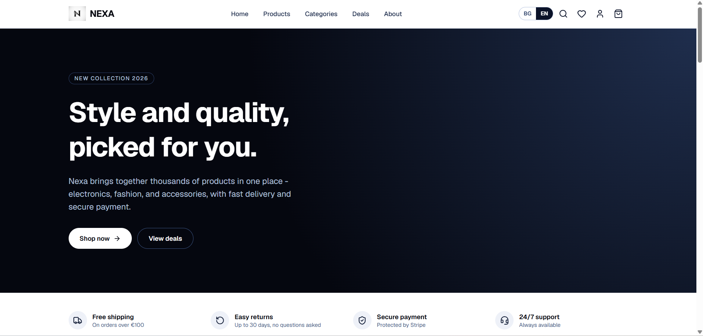

</div>

<br/>

Nexa is a full-featured online store - a complete storefront, self-service customer accounts, and an internal admin panel, all wired to **real backend services** rather than mocked data. It's bilingual (🇧🇬 Bulgarian / 🇬🇧 English), shows dual EUR/BGN pricing, and ships an animated, polished UI on top of a production-shaped architecture: real auth, a real database, real payments infrastructure.

## ✨ Features

### 🛒 Storefront
- 🔍 Full product catalog with category, price, rating, and brand filters, sorting, and pagination
- 🖼️ Product detail pages with image galleries, tabs (description / shipping / reviews), and related products
- ⚡ Live search with an instant dropdown + a dedicated results page
- 🏷️ Deals page, sorted by biggest discount
- ❤️ Cart & wishlist that **persist to your account** when signed in, falling back to `localStorage` as a guest - merged automatically the moment you sign in
- 💶 Dual-currency pricing (EUR primary, BGN alongside) throughout the site
- 🌍 Fully bilingual UI (BG/EN) via locale-prefixed routing, with translated metadata and content
- 🎬 Smooth, purposeful motion everywhere - hover states, staggered grids, page transitions - built on [`motion`](https://motion.dev)

<div align="center">
<table><tr>
<td width="50%">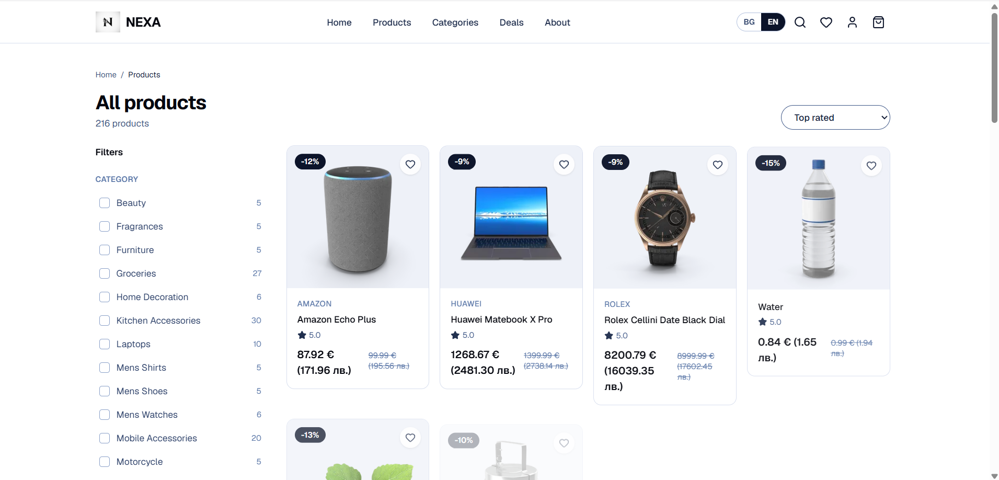</td>
<td width="50%">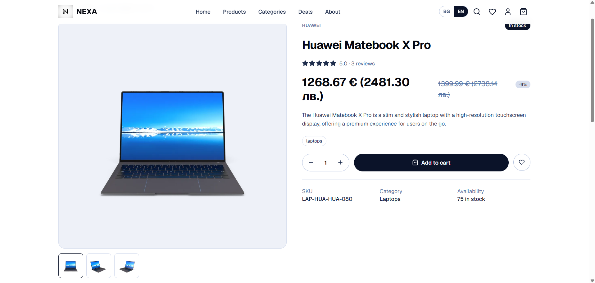</td>
</tr></table>
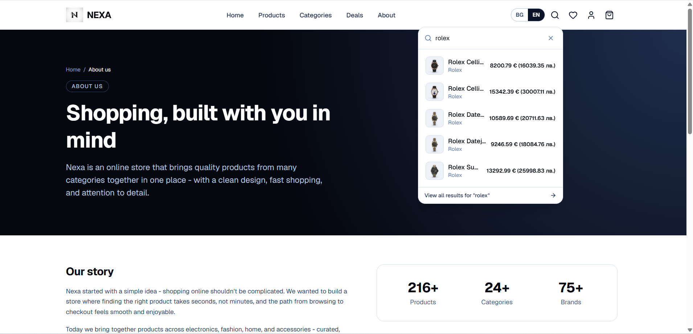
</div>

### 👤 Accounts & Auth
- 🔐 Supabase Auth - email/password **and** "Sign in with Google"
- ⚙️ Self-service profile settings: display name, phone number, avatar upload (Supabase Storage), and password changes
- 🟢 Session-aware header (avatar, join date, sign-out) that updates live across the app

<div align="center">
<table><tr>
<td width="50%">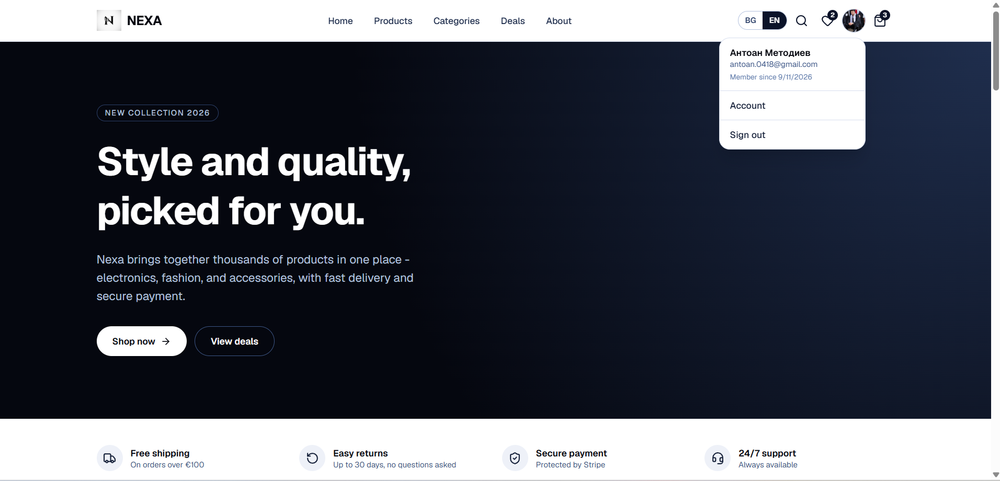</td>
<td width="50%">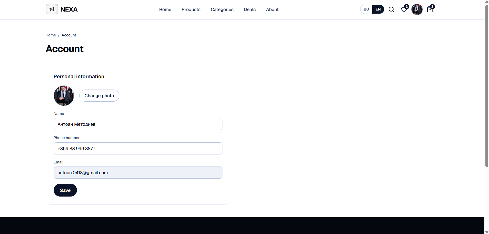</td>
</tr></table>
</div>

### 💳 Checkout & Payments
- 🧾 Stripe Checkout (hosted Checkout Session) - guest **and** signed-in checkout
- 🪝 Webhook-driven order recording - orders are only written to the database once payment is *confirmed*, never eagerly from the client
- 🚚 Dynamic shipping cost, based on an admin-configurable free-shipping threshold

<div align="center">
<table><tr>
<td width="50%">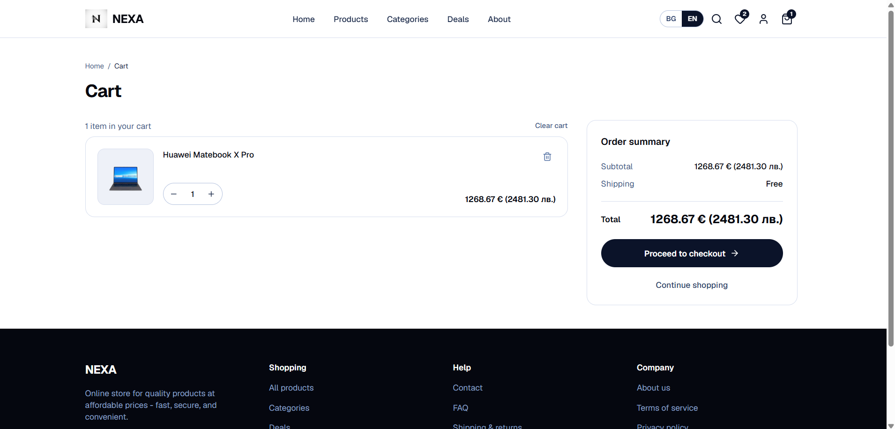</td>
<td width="50%">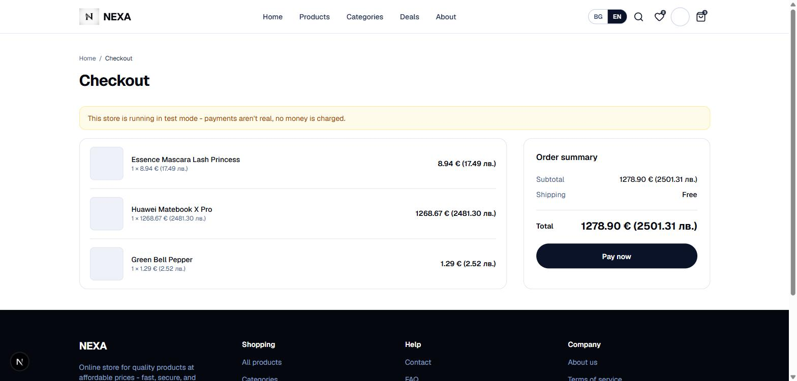</td>
</tr></table>
</div>

### 🛠️ Admin Panel
A code-complete internal dashboard at `/admin`, gated by role-based access control:

| Section | What it does |
|---|---|
| 📊 Dashboard | Live stats - products, categories, orders, revenue, active promo codes |
| 📦 Products | Full CRUD with a proper form, images, stock, pricing |
| 🗂️ Categories | Merge products between categories |
| 🧺 Orders | List + detail views, status updates |
| 🧑‍🤝‍🧑 Customers | Real signed-up users - not mock data |
| 🎟️ Discounts | Percentage or fixed-amount promo codes |
| ⚙️ Settings | Contact info & free-shipping threshold - reflected live on the public site |

## 🧰 Tech Stack

| Layer | Technology |
|---|---|
| 🖼️ Framework | [Next.js](https://nextjs.org) (App Router) |
| 📘 Language | TypeScript |
| 🎨 Styling | Tailwind CSS |
| 🎬 Animation | [motion](https://motion.dev) |
| 🗄️ Database, Auth & Storage | [Supabase](https://supabase.com) (Postgres + Row Level Security) |
| 💳 Payments | [Stripe](https://stripe.com) (Checkout Sessions + webhooks) |
| 🌍 i18n | [next-intl](https://next-intl.dev) |
| ☁️ Deployment | Cloudflare Workers, via [vinext](https://github.com/vinxi/vinext) |
| 🌱 Seed data | [DummyJSON](https://dummyjson.com) |

## 🚀 Getting Started

### Prerequisites
- Node.js 20+
- A [Supabase](https://supabase.com) project
- A [Stripe](https://stripe.com) account (test mode is enough for local dev)

### Setup

```bash
npm install
```

Create a `.env.local`:

```bash
NEXT_PUBLIC_SUPABASE_URL=
NEXT_PUBLIC_SUPABASE_PUBLISHABLE_KEY=
SUPABASE_SERVICE_ROLE_KEY=
STRIPE_SECRET_KEY=
STRIPE_WEBHOOK_SECRET=
```

Run the SQL migrations in `supabase/migrations/` against your Supabase project (SQL Editor, in numeric order), then seed the catalog:

```bash
npm run db:seed        # base catalog, pulled from DummyJSON
npm run db:seed-more    # a hand-curated set of extra (mostly tech) products
```

Start the dev server:

```bash
npm run dev
```

Open [http://localhost:3000](http://localhost:3000) 🎉

For local Stripe webhook testing, forward events with the [Stripe CLI](https://stripe.com/docs/stripe-cli):

```bash
stripe listen --forward-to localhost:3000/api/webhooks/stripe
```

## ☁️ Deployment

Nexa deploys to **Cloudflare Workers** via [vinext](https://github.com/vinxi/vinext), a Vite-based Next.js runtime built for the Workers platform:

```bash
npm run build:vinext
npm run deploy:vinext
```

The standard `npm run dev` / `npm run build` (plain Next.js) keep working as usual for local development.

## 📁 Project Structure

```
src/
  app/[locale]/(shop)/    Public storefront pages (cart, checkout, account, auth, etc.)
  app/[locale]/admin/     Admin panel
  app/api/webhooks/       Stripe webhook handler
  app/auth/callback/      OAuth callback route
  components/             UI components, grouped by feature area
  lib/                    Data access, contexts, Supabase/Stripe clients, server actions
  i18n/                   next-intl routing/navigation config
supabase/migrations/      Versioned SQL migrations
messages/                 bg.json / en.json translation catalogs
```

## 📸 More Screenshots

<div align="center">
<table>
<tr>
<td width="33%">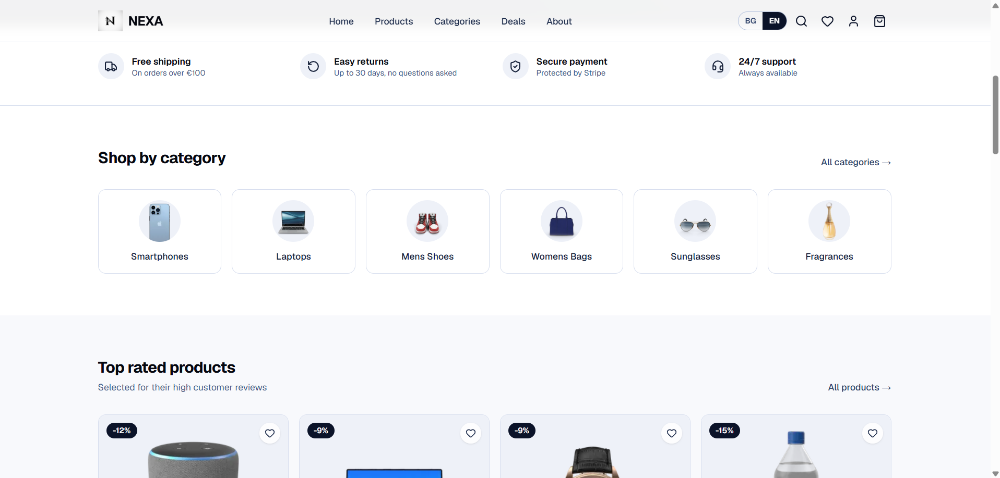<p align="center">Shop by category</p></td>
<td width="33%">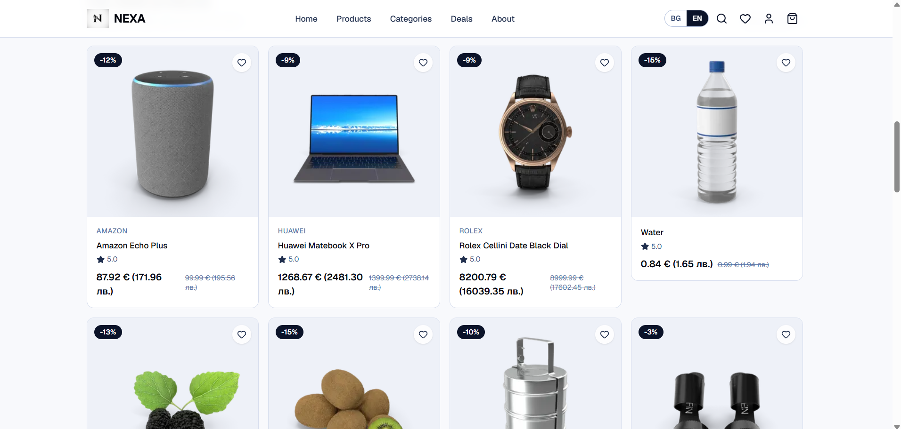<p align="center">Top rated products</p></td>
<td width="33%">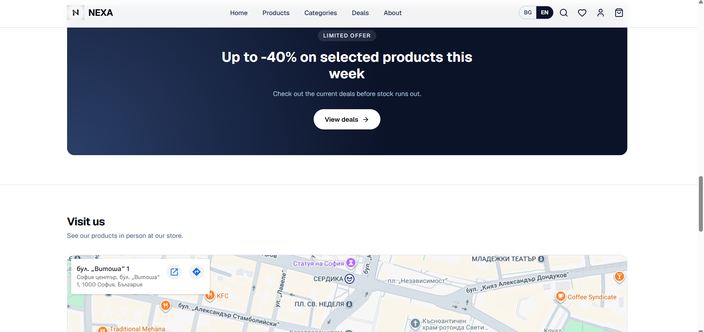<p align="center">Deals promo banner</p></td>
</tr>
<tr>
<td width="33%">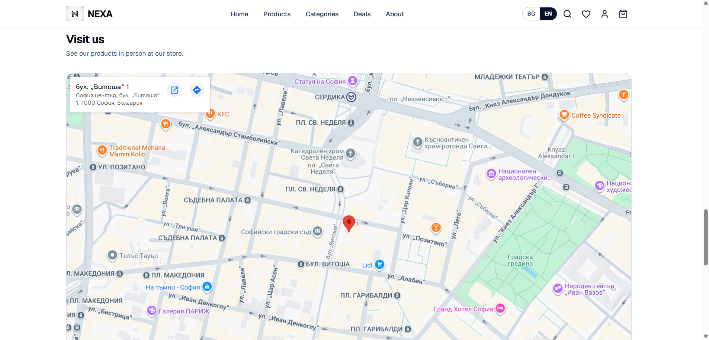<p align="center">Store location map</p></td>
<td width="33%">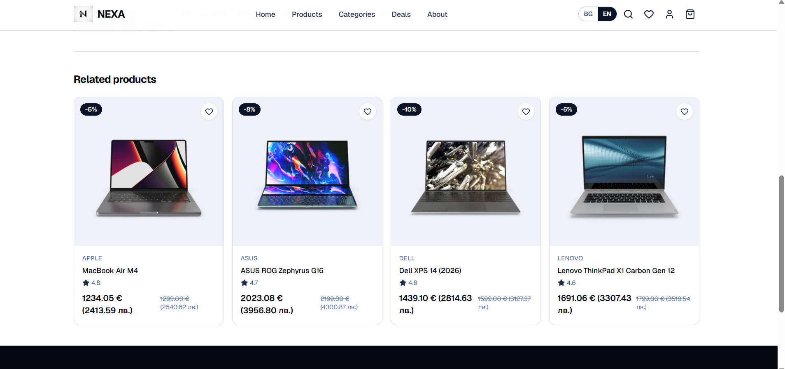<p align="center">Related products</p></td>
<td width="33%">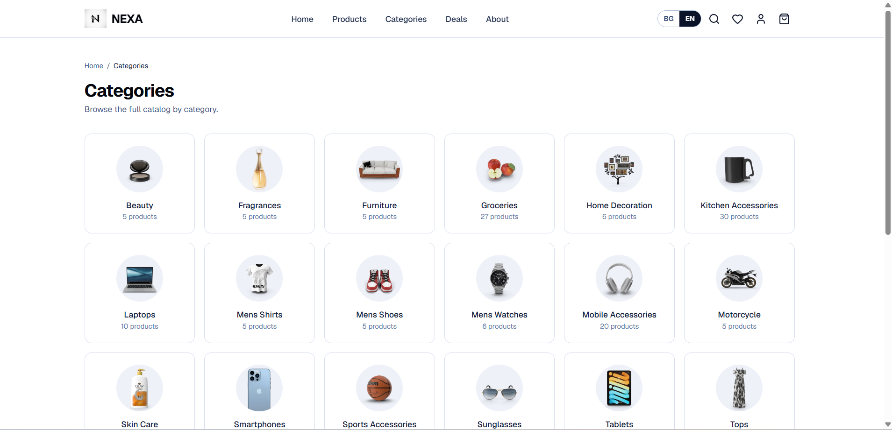<p align="center">Categories page</p></td>
</tr>
<tr>
<td width="33%">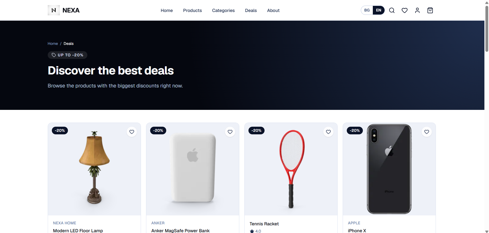<p align="center">Deals page</p></td>
<td width="33%">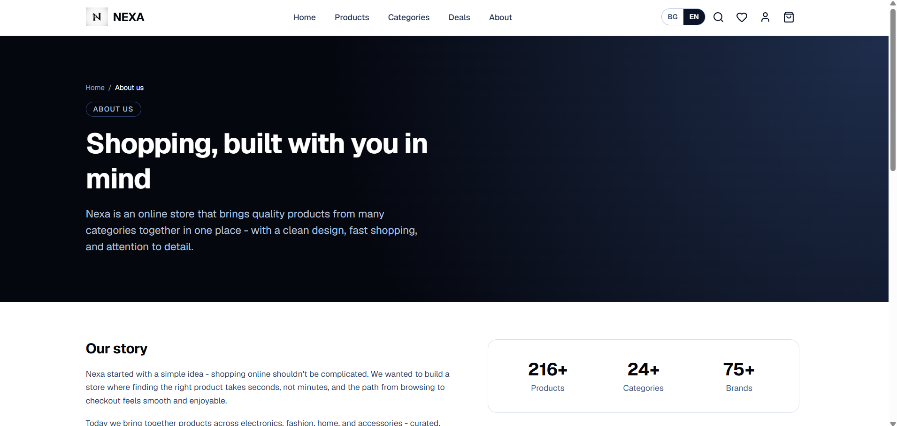<p align="center">About page</p></td>
<td width="33%">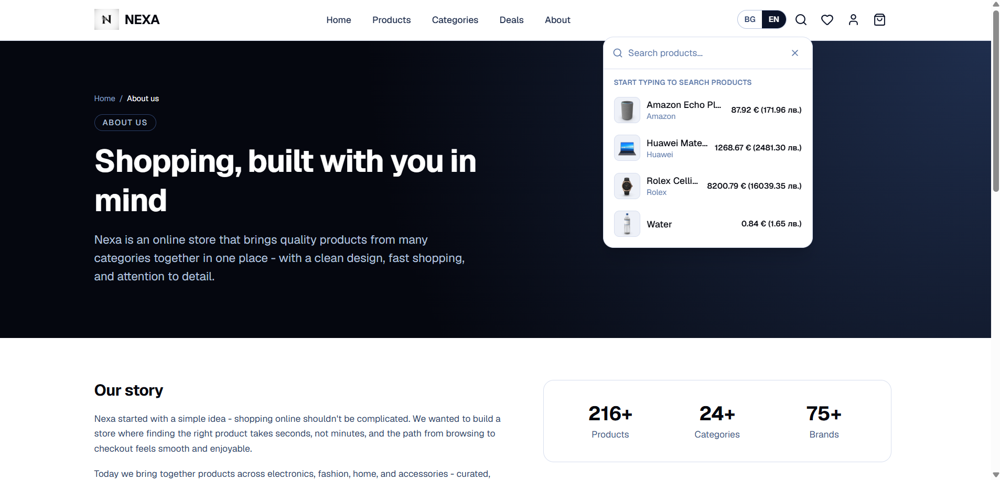<p align="center">Search suggestions</p></td>
</tr>
<tr>
<td width="33%">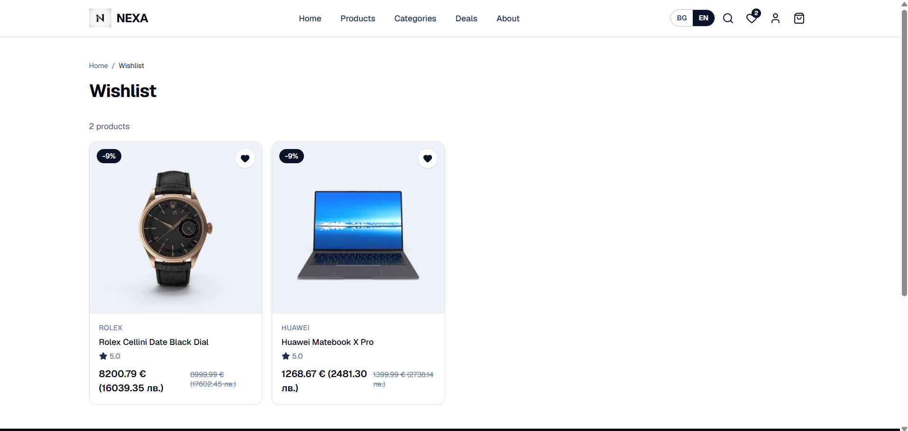<p align="center">Wishlist</p></td>
<td width="33%">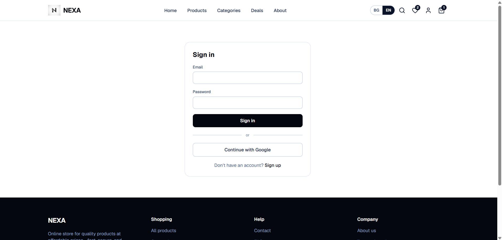<p align="center">Sign in</p></td>
<td width="33%">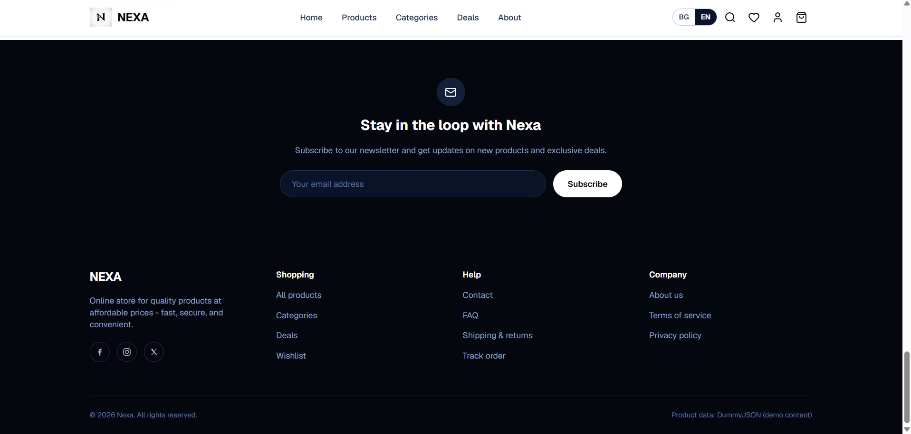<p align="center">Newsletter & footer</p></td>
</tr>
</table>
</div>

## 📝 Notes

- 🌱 Product data is seeded from [DummyJSON](https://dummyjson.com) for demo purposes, supplemented with hand-authored listings - this is not a real inventory.
- 🧪 Stripe is configured in **test mode** - no real payments are processed.

---

<div align="center">

Built as a hands-on exercise in shipping a production-shaped e-commerce app end-to-end - real auth, a real database, real payments infrastructure, and an admin surface to run it all.

</div>
